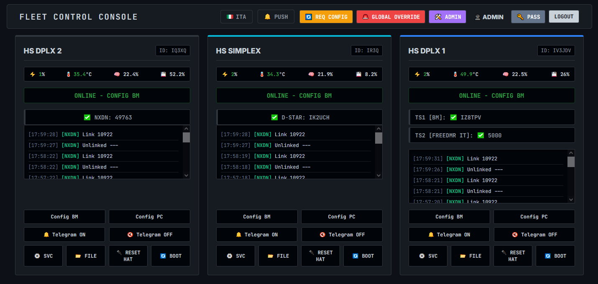

# 📡 Fleet Control Console - Server (Central Hub)

🌍 *[Read in English](#english) | 🇮🇹 [Leggi in Italiano](#italiano)*

---



<a name="english"></a>
## 🇬🇧 English

**Fleet Control Console** is a professional, real-time command and control (C2) dashboard designed for amateur radio repeater networks (MMDVM). This repository contains the **Server (Central Hub)** component, which provides a centralized web interface to monitor and manage a fleet of remote digital voice nodes (DMR, NXDN, YSF, P25).

> ℹ️ **Note:** This is the Central Server repository. To monitor remote repeaters, you must install the [Fleet Control Agent](https://git.arifvg.it/iv3jdv/fleet-control-agent.git) on each node.

### 🏗️ Architecture & Technology Stack
The server acts as the brain of the network:
* **Backend:** Flask (Python) with `gevent` for high-concurrency handling.
* **Database:** SQLite (WAL mode) for robust User Management, Audit Logs, and Radio Traffic storage.
* **Communication:** MQTT for instant data routing + WebSockets (SocketIO) for zero-latency UI updates.
* **Frontend:** Vanilla JS with a modern *Glassmorphism* NOC (Network Operations Center) design.

### ✨ Ultimate Features

#### ⚡ Zero-Latency Real-Time Dashboard
* **WebSocket Powered:** The dashboard updates instantly upon radio traffic or telemetry changes. No heavy HTTP polling, no page reloads.
* **Live MQTT Status:** A real-time badge continuously monitors the connection to the MQTT broker, instantly alerting you if the backend loses connectivity.
* **PWA Ready:** Install the dashboard as a Progressive Web App on iOS/Android for a native, full-screen mobile experience.

#### 🔔 Web Push Notifications
* Get instant, native alerts directly on your desktop or mobile device when:
  * A node goes offline or comes back online.
  * A critical system daemon crashes (Auto-healing failed).
* Works securely even when the web app is closed or in the background.

#### 🛠️ Advanced Remote Control & Maintenance
* **Remote .INI Editor:** Edit daemon configuration files (e.g., MMDVMHost.ini) directly from the web interface without SSH access.
* **Service Management:** Start, Stop, or Restart remote system daemons with a single click.
* **Global Overrides:** Switch profiles (e.g., Profile A/B) or force updates simultaneously on all nodes in the fleet.
* **Hardware Interventions:** Trigger a physical OS reboot or a hard GPIO reset of the MMDVM HAT directly from the web panel.

#### 📊 Unified Monitoring & Statistics
* **Live Heard Log:** A centralized view of radio traffic across the entire network, auto-resolving DMR and NXDN IDs into callsigns.
* **Real-Time Telemetry:** Monitor CPU, RAM, Disk, and Temperature for every connected node.
* **Daily Analytics:** Automatically tracks Top Talkgroups, Top Callsigns, Average duration, and daily transit counts.

#### 🔐 Security & Access Control
* **Role-Based Access Control (RBAC):** Create `admin` and `operator` accounts.
* **Granular Permissions:** Restrict operators to view/control only specific repeaters.
* **Audit Trail:** Every critical action (reboots, config edits, daemon restarts) is logged with the username, timestamp, and target node.

### 🚀 Installation Guide

#### 0. System Pre-requisites (Critical)
Before installing Python dependencies, install the necessary system compilers and pip/venv tools. On Debian/Ubuntu:
```bash
sudo apt update
sudo apt install build-essential python3-dev libssl-dev libffi-dev python3-pip python3-venv
```
#### 1. Clone Repository
Clone the repository into the /opt directory to ensure all systemd paths work correctly:
```bash
sudo git clone https://tuo-gitea.com/utente/fleet-control-server.git /opt/fleet-control-server
cd /opt/fleet-control-server
```
#### 2. Virtual Environment Setup (Recommended)
To prevent conflicts with OS packages (PEP 668), create an isolated environment:
```bash
cd /opt/fleet-control-server
python3 -m venv venv
source venv/bin/activate
pip install --upgrade pip setuptools wheel
pip install -r requirements.txt
```

#### 3. Configuration
1. Copy `config.example.json` to `config.json`.
2. Configure your MQTT broker credentials.
3. Define your repeaters in `clients.json`.
4. Generate VAPID keys at [vapidkeys.com](https://vapidkeys.com/) and add them to `config.json` to enable Web Push notifications. *(Note: Push notifications require HTTPS).*

#### 4. Running as a Service
To run the server continuously in production using Gunicorn:
```bash
sudo cp fleet-console.service /etc/systemd/system/
sudo systemctl daemon-reload
sudo systemctl enable fleet-console
sudo systemctl start fleet-console
```
*(Ensure the `.service` file points to the `gunicorn` executable inside your `venv`)*.

---

<a name="italiano"></a>
## 🇮🇹 Italiano

**Fleet Control Console** è una dashboard di comando e controllo (C2) professionale in tempo reale, progettata per le reti di ripetitori radioamatoriali (MMDVM). Questo repository contiene il **Server (Central Hub)**, che fornisce un'interfaccia web centralizzata per monitorare e gestire una flotta di nodi digitali remoti (DMR, NXDN, YSF, P25).

> ℹ️ **Nota:** Questo è il repository del Server Centrale. Per monitorare i ripetitori, devi installare il [Fleet Control Agent](https://git.arifvg.it/iv3jdv/fleet-control-agent.git) su ciascun nodo remoto.

### 🏗️ Architettura e Tecnologie
Il server agisce da cervello della rete:
* **Backend:** Flask (Python) con `gevent` per la gestione ad alta concorrenza.
* **Database:** SQLite (in modalità WAL) per gestire in sicurezza Utenti, Log operativi e traffico radio.
* **Comunicazione:** MQTT per il routing istantaneo dei dati + WebSockets (SocketIO) per aggiornare la UI a latenza zero.
* **Frontend:** Vanilla JS con un moderno design *Glassmorphism* in stile NOC (Network Operations Center).

### ✨ Funzionalità Principali

#### ⚡ Dashboard Real-Time a Latenza Zero
* **Motore WebSocket:** La dashboard scatta all'istante al passaggio di traffico radio o ai cambi di telemetria. Nessun polling HTTP pesante, nessun refresh della pagina.
* **Stato MQTT Live:** Un badge in tempo reale monitora continuamente la connessione al broker MQTT, avvisandoti istantaneamente in caso di problemi di rete.
* **PWA Ready:** Installabile su smartphone Android e iOS come Progressive Web App per un'esperienza nativa a schermo intero.

#### 🔔 Notifiche Web Push
* Ricevi avvisi nativi e immediati su PC o smartphone quando:
  * Un nodo va offline o torna operativo.
  * Un demone di sistema remoto si blocca (fallimento auto-healing).
* Funzionano in modo sicuro anche quando la web app è chiusa o in background.

#### 🛠️ Controllo Remoto & Manutenzione Avanzata
* **Editor .INI Remoto:** Modifica i file di configurazione (es. MMDVMHost.ini) direttamente dal pannello web, senza bisogno di accessi SSH.
* **Gestione Demoni:** Avvia, arresta o riavvia i servizi di sistema remoti con un clic.
* **Override Globali:** Cambia i profili operativi (es. Profilo A/B) simultaneamente su tutta la rete.
* **Interventi Hardware:** Innesca un riavvio del sistema operativo o un reset fisico (tramite pin GPIO) della scheda MMDVM direttamente dall'interfaccia web.

#### 📊 Monitoraggio & Statistiche
* **Log Ascolti Live:** Vista unificata in tempo reale del traffico radio di tutta la rete, con traduzione automatica degli ID DMR e NXDN in nominativi.
* **Telemetria in Diretta:** Monitora l'utilizzo di CPU, RAM, Disco e le Temperature per ogni nodo connesso.
* **Analisi Giornaliera:** Statistiche automatiche su Top Talkgroups, Top Callsign, durata media e numero totale di transiti.

#### 🔐 Sicurezza e Controllo Accessi
* **Gestione Ruoli (RBAC):** Creazione di account `admin` e `operator`.
* **Permessi Granulari:** Limita un operatore al controllo e alla visualizzazione di specifici ripetitori.
* **Audit Trail:** Ogni azione critica (riavvii, modifiche file, gestione demoni) viene registrata con data, ora, utente e nodo di destinazione.

### 🚀 Guida all'Installazione

#### 0. Requisiti di Sistema (Critici)
Prima di installare le dipendenze Python, installa i compilatori di base e gli strumenti per gli ambienti virtuali. Su Debian/Ubuntu:
```bash
sudo apt update
sudo apt install build-essential python3-dev libssl-dev libffi-dev python3-pip python3-venv
```
#### 1. Clonazione dei Repository
Clona il repository nella cartella /opt per assicurarti che tutti i percorsi dei servizi systemd siano corretti:
```bash
sudo git clone https://tuo-gitea.com/utente/fleet-control-server.git /opt/fleet-control-server
cd /opt/fleet-control-server
```
#### 2. Setup Ambiente Virtuale (Consigliato)
Per evitare conflitti con i pacchetti di sistema (regola PEP 668), crea una "bolla" isolata:
```bash
cd /opt/fleet-control-server
python3 -m venv venv
source venv/bin/activate
pip install --upgrade pip setuptools wheel
pip install -r requirements.txt
```

#### 3. Configurazione Base
1. Copia `config.example.json` in `config.json`.
2. Inserisci le credenziali del broker MQTT.
3. Definisci i ripetitori nel file `clients.json`.
4. Genera le chiavi VAPID su [vapidkeys.com](https://vapidkeys.com/) e inseriscile in `config.json` per attivare le notifiche Push. *(Attenzione: le notifiche Push richiedono obbligatoriamente un certificato HTTPS).*

#### 4. Esecuzione come Servizio (systemd)
Per eseguire il server in produzione in modo continuo e stabile con Gunicorn:
```bash
sudo cp fleet-console.service /etc/systemd/system/
sudo systemctl daemon-reload
sudo systemctl enable fleet-console
sudo systemctl start fleet-console
```
*(Assicurati che il file `.service` punti all'eseguibile `gunicorn` situato all'interno della cartella `venv`).*

---
*Created by IV3JDV @ ARIFVG - 2026*
